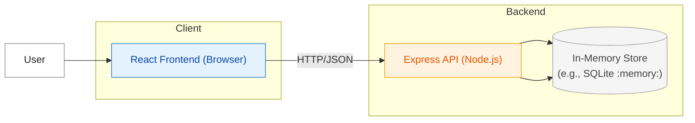
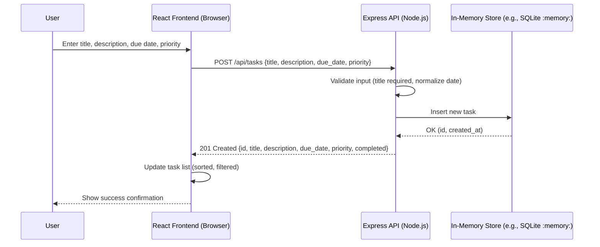

# Cloud Architecture Overview

This document provides a simple system context view of the monorepo application: a React frontend, an Express API backend, and an in-memory data store (development).

Notes
- Environment: Dev container on Ubuntu; backend uses an in-memory store (non-persistent).
- Communication: The React app calls the Express API via HTTP using JSON payloads.
- Persistence: Data resets on server restart; no external DB or cloud services in MVP.
- Next steps: Replace in-memory storage with a persistent database and add auth/gateway if needed.

## Sequence: Create TODO

